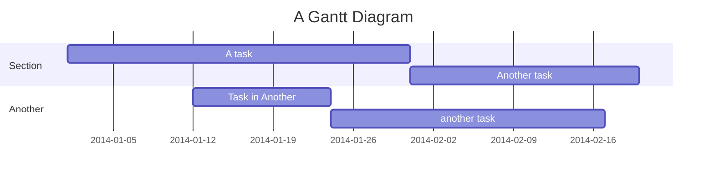

# header

## header 2


some more text

- 1
- 2

*italic* **bold**


```mermaid
gantt
    title A Gantt Diagram
    dateFormat YYYY-MM-DD
    section Section
        A task          :a1, 2014-01-01, 30d
        Another task    :after a1, 20d
    section Another
        Task in Another :2014-01-12, 12d
        another task    :24d
```

python

```python
import numpy as np
import pandas as pd
plt.plot(x,y)
```